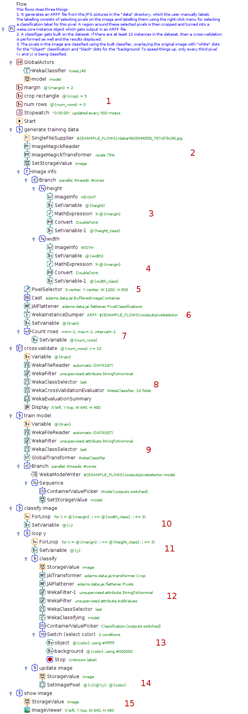
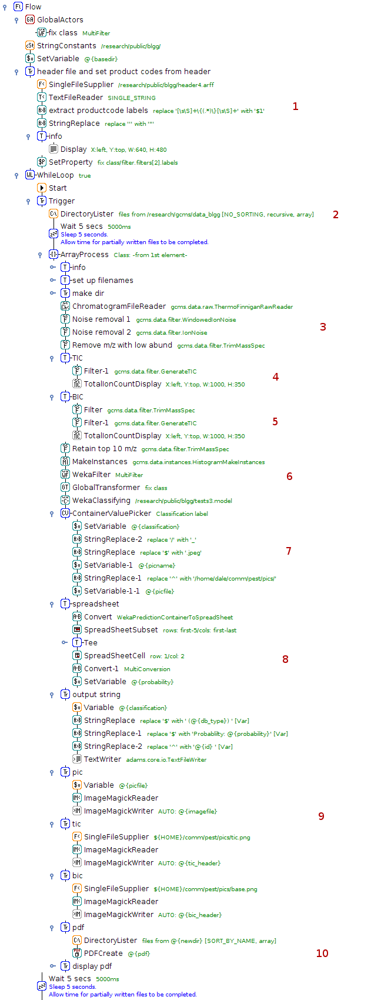

.. title: Examples - Advanced
.. slug: users-examples-advanced
.. date: 2015-12-18 14:47:22 UTC+13:00
.. tags: 
.. category: 
.. link: 
.. description: 
.. type: text
.. author: FracPete

.. contents::

Large, complex flows that's where ADAMS' strength really lies. Its compact
layout helps you not to lose the overview. Use loops, internal storage and much
more to create solutions to your problems.

**Note:** the videos should only be considered educational, as some of the
concepts in ADAMS have changed over time. E.g., *global* actors are now called
*callable*, since they can appear in different scopes within the flow. Also,
*SingleFileSupplier* and *MultiFileSupplier* got merged into the *FileSupplier*
actor.

Pixel classification
--------------------

Performs pixel area classification (background or object) with a WEKA
classifier trained on regions selected by the user.

1. Parameter initialization
2. Loading and pre-processing of image, storing in internal storage for future retrieval
3. Extract image height and store it in a variable
4. Extract and store image width in variable as well
5. Interacting with the user, choosing pixel regions used as traingin data
6. Generate training data for WEKA classifier
7. Keep track of number of training instances
8. Cross-validate (and output results) on training data only if there are at
   least 10 instances in the data
9. Train the classifier, stored model on disk for future use and in the
   internal storage as well for performing the classification task
10. Outer loop for traversing X (every 3rd pixel)
11. Inner loop for traversing Y (every 3rd pixel as well)
12. Extract pixel region around current X and Y, turn into a WEKA instance and
    make prediction
13. Choose the color for background or object classification
14. Update the pixel at the current position
15. Display the modified image

.. media:: https://www.youtube.com/watch?v=cuop0RAG35w

Sample type checker
-------------------

Using the GC-MS extension modules, this flow performs a check on the sample
type of GC-MS spectra and can send the analyst an email with the results. The
spectra themselves are obtained from fruit and vegetable samples.

1. Retrieve classification available classification labels
2. List all chromatogram files
3. Load and pre-process chromatograms one-by-one
4. Show Total-ion-count and take a screenshot for report
5. The same with the Baseline-ion-count
6. Turn chromatogram into WEKA instance and predict the class label
7. Determine the fruit/vegetable picture associated with the label
8. Create a spreadsheet from the class distribution (top 5)
9. Generate various output for the PDF report
10. Generate PDF report

.. media:: https://www.youtube.com/watch?v=UWS7cBerBT8

**An application of data mining to fruit and vegetable sample identification
using Gas Chromatography-Mass Spectrometry**

Geoffrey Holmes, Dale Fletcher, and Peter Reutemann (2012). An application of data mining to fruit and vegetable sample identification using Gas Chromatography-Mass Spectrometry. Proceedings of the International Congress on Environmental Modelling and Software (IEMSS), Leizpig, Germany, 2012. [`pdf <samplechecker_>`__]

Spectral analysis
-----------------

Using GC-MS extension modules, this flow processes spectral data generating
predictions for compounds. The user can correct the guessed peaks
interactively, before the concentrations are calculated.

.. image:: ../images/spectralanalysis.png

1. Set up external flows, relative to current one
2. Set up variables for serialized regression model files
3. Prompt user to select spectra
4. Determine extension of currently processed spectrum
5. Prompt user to enter additional parameters
6. Load file, executing subflow depending on file extensions
7. Guess type of compound based on filename and prompt with pre-selected choice
8. Process spectrum, guessing peaks using external flow
9. Prompt user to inspect selected peaks, allow user to correct them
10. Turn spectrum into WEKA data structure and make prediction on peak area for
    all compounds
11. Assemble predictions, display them and copy them to the clipboard as well
    before proceeding with the next data file

.. media:: https://www.youtube.com/watch?v=P6KceexcfZo

.. _samplechecker: http://www.cms.waikato.ac.nz/~fracpete/publications/2012/iemss2012.pdf

