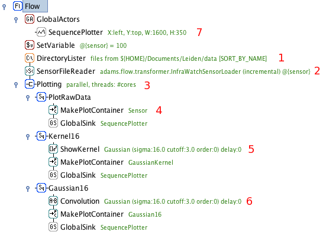
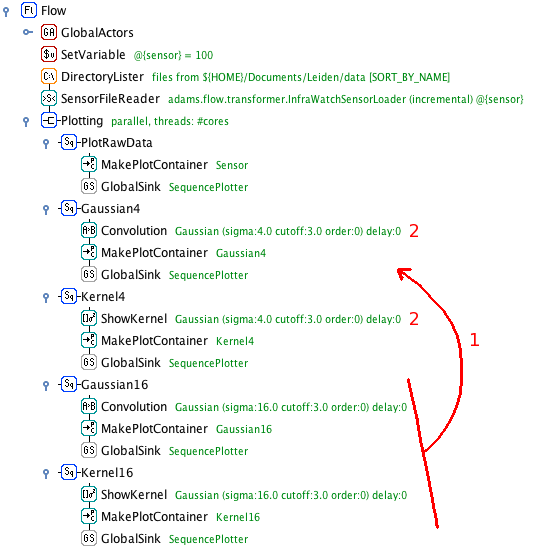
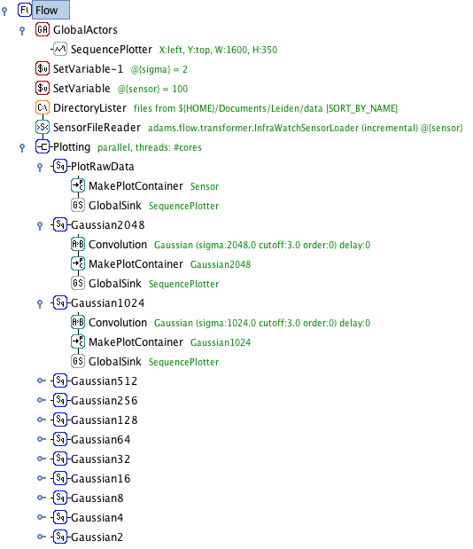
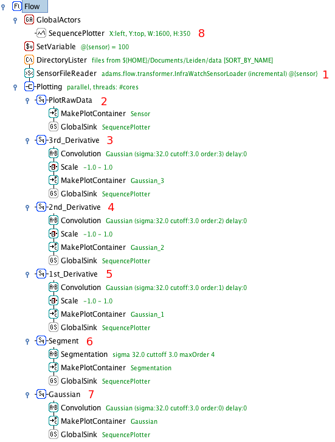

.. title: Examples - Time series
.. slug: users-examples-timeseries
.. date: 2015-12-18 14:47:22 UTC+13:00
.. tags: 
.. category: 
.. link: 
.. description: 
.. type: text
.. author: FracPete

.. contents::

ADAMS' efficient token-passing architecture makes it ideal to handle streams of
data. It is also very easy to extend. In these examples, we introduce new
actors for several signal analysis techniques, and show how we can quickly
build and test workflows to analyse time series data.

**Note:** the videos should only be considered educational, as some of the
concepts in ADAMS have changed over time. E.g., *global* actors are now called
*callable*, since they can appear in different scopes within the flow. Also,
*SingleFileSupplier* and *MultiFileSupplier* got merged into the *FileSupplier*
actor.

Convolution - Finding the signal in the noise
---------------------------------------------

Sensor data is often noisy and complex. Here, we introduce an actor for
convolution_, an operation that transforms the data into something more useful.

Smoothing
+++++++++

First, we convolute the signal with a Gaussian response function (or kernel) to
obtain a much cleaner signal.

1. Retrieve data files from the given folder. Emits the files as tokens.
2. Load and interpret the files and emit [timestamp,sensorvalue] tokens for
   every new timestamp.
3. Branch actor: each token is sent to three subflows for further processing.
4. This branch simply plots the data. Timestamp and sensor value are mapped
   straight to an X and Y coordinate, [X:timestamp,Y:sensorvalue], then sent to
   the plotter.
5. Visualize the used kernel (here, a Gaussian kernel). Emits values to plot
   the kernel, centered on the received timestamp.
6. Convolute the received data with the kernel. The agent buffers the last N
   tokens (N=kernel width), and emits the convoluted data points.
7. Global plotter for all data. Receives tokens sent to all GlobalSink actors
   linked to it.

.. media:: https://www.youtube.com/watch?v=D0F-NPerCIE

Smoothing at different levels
+++++++++++++++++++++++++++++

Changing the width of the kernel allows us to focus on events occurring on
different time scales. Simply copy-paste the last two branches and change the
kernel widths.

.. raw:: html

    

.. media:: https://www.youtube.com/watch?v=9QYYzh-VLeQ

Scale-space composition
+++++++++++++++++++++++

Convoluting the same signal with a whole range of different kernel widths
creates a so-called scale space, a space of signals sensitive to events at
different time scales.

1. Copy-paste the convolution branches
2. Increase the kernel width. Here, we double it each time

.. media:: https://www.youtube.com/watch?v=-sIgbedKxVo

Scale-space decomposition
+++++++++++++++++++++++++

Decomposition of a sensor signal into components displaying events occurring on
different time scales. Detecting transient events when these events occur on
different timescales in data prone to baseline shifts can be very tricky.
Through scale-space decomposition, we decompose the raw signal into its natural
components, and use those to detect events. This is done by taking the scale
space and establishing 'regions' of the scale space where events of a certain
time scale take place. Each region will be represented by a component,
calculated by substracting the convolutions at either end of the region.
The latter is also known as a 'difference of Gaussians' filter, or
band-pass filter. The sum of the components recreates the original signal.

.. image:: ../../images/decomposition.png

1. Sensor data is read and split into individual tokens as before
2. The data is subsampled: only every 100th token is passed on
3. The baseline of the data is created through convolution with a large
   Gaussian, only sensitive to large-scale events
4. The first band-pass filter is applied. It takes the difference of the
   Gaussians of width 64 and 16. The result is sent to the plotter
5. Second band-pass filter, for signals in the range sigma=[4,16]
6. Third band-pass filter, for signals in the range sigma=[0,4]

.. media:: https://www.youtube.com/watch?v=7eEjwX_5K8k

Segmentation of time series data
--------------------------------

A time series can be approximated by a piecewise linear function. This will
result in a time series that is significantly smaller in size (disk space), and
thus easier to store and process.

Segmentation through convolution
++++++++++++++++++++++++++++++++

One way of approximating the signal is to begin a new line segment if the
signal changes it's slope drastically. These points can be found by taking the
1st, 2nd, 3rd,... order derivative of the signal and start a new line segment
for every zero-crossing of these derivatives. Instead of first calculating the
convolution of a signal and then taking its derivative, we can achieve the same
result by convoluting the signal with the derivative of the kernel used for
convolution! Thus, we take the 1st, 2nd, 3rd,... order derivative of the
Gaussian kernel, do their convolutions, and start a new line segment at any
zero-crossings.

1. Load and split the data into tokens as before
2. Plot the raw sensor data
3. Compute the third order derivative of the convolution and normalize it
   between -1 and 1 (for nicer plotting)
4. Compute the second order derivative of the convolution and normalize it
   between -1 and 1
5. Compute the first order derivative of the convolution and normalize it between -1 and 1
6. The segmentation agent does the same as the above three branches, but only
   lets through a token (unaltered) if one of the derivates crosses zero
7. Compute and plot the convolution with the base Gaussion kernel
8. The plotter collects and plots all received tokens

.. media:: https://www.youtube.com/watch?v=Px82ohXmJO4

Discrete Fourier Transform of sensor data
-----------------------------------------

Applying DFT
++++++++++++

Applying discrete fourier transformation to the sensor data and displaying the
frequency domain.

.. image:: ../../images/fft.png

1. Select the FFT Conversion in the Convert actor.

.. media:: https://www.youtube.com/watch?v=9QYYzh-VLeQ

.. _convolution: http://en.wikipedia.org/wiki/Convolution

