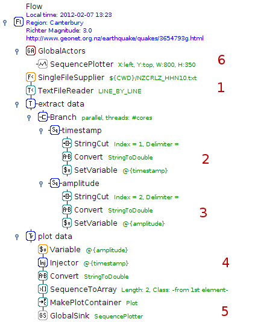

.. title: Examples - Visualization
.. slug: users-examples-visualization
.. date: 2015-12-18 14:47:22 UTC+13:00
.. tags: 
.. category: 
.. link: 
.. description: 
.. type: text
.. author: FracPete

.. contents::

A picture says more than a thousand words. This is even more so true for
statistics. Visualizing results, generating plots from data is an integral part
of ADAMS. Check out what ADAMS can do in the visual department.

**Note:** the videos should only be considered educational, as some of the
concepts in ADAMS have changed over time. E.g., *global* actors are now called
*callable*, since they can appear in different scopes within the flow. Also,
*SingleFileSupplier* and *MultiFileSupplier* got merged into the *FileSupplier*
actor.

Learning curve for a WEKA classifier
------------------------------------

Generates and visualizes a learning curve for J48, a non-incremental WEKA
classifier. The classifier gets trained every 25 instances and evaluated
against test set and Accuracy, RMSE and AUC gets plotted in one plot.

.. image:: ../images/learning_curve.png

1. Read in dataset incrementally and buffer incoming data
2. Every 25 instances, build classifier and evaluate against test set (defined
   as global actor, see 6)
3. Obtain accuracy and create a plot container for Accuracy plot sequence
4. Get root mean squared error and turn it into a plot container as well, this
   time for the RMSE sequence
5. Retrieve AUC (area under curve) statistics and generate plot container for
   AUC sequence.
6. Sequence of actors for reading in a test set
7. The plot for all three statistics

.. media:: https://www.youtube.com/watch?v=Bq2oAhD3qL8 

Visualization of seismic data
-----------------------------

Seismic data was retrieved using the Geonet client.

1. Read text file, line by line
2. Extract Unix timestamp, convert into double and store as variable
3. Extract amplitude, convert into double and store as variable
4. Turn timestamp and amplitude into a double array
5. Generate data structure for plot
6. The global plot

.. media:: https://www.youtube.com/watch?v=HP4wvUnUPCY

Email alerts for seismic events
-------------------------------

Seismic data was retrieved using the `Geonet client <geonet_>`__. Apart from
visualizing the data, this flow also sends out an email alert if a tremor
exceeds a certain strength.

.. image:: ../images/geonet2.png

1. Read text file, line by line
2. Extract Unix timestamp, convert into double and store as variable
3. Convert timestamp into human-readable representation for email
4. Extract amplitude, convert into double and store as variable
5. Check whether incoming token (amplitude) is larger than threshold and email
   hasn't been sent yet
6. Note that email was sent and send email with information about event (time/date and amplitude)
7. Turn timestamp and amplitude into a double array
8. Generate data structure for plot
9. The global plot

.. media:: https://www.youtube.com/watch?v=vdN9Uxson5o

LEIA - visualizing bridge sensor data
-------------------------------------

Visualizing sensor data of the InfraWatch project using the LEIA/ADAMS framework:

Bridge vibration
++++++++++++++++

Illustration of sensor data processing with the ADAMS/LEIA workflow engine.

.. media:: https://www.youtube.com/watch?v=zxReYlFjTbc

Vehicle detection
+++++++++++++++++

Demonstration of the ADAMS/LEIA workflow engine on traffic sensor data.

.. media:: https://www.youtube.com/watch?v=C32npFLSaug

**Publication**

Knobbe, A., Blockeel, H., Koopman, A., Calders, T., Obladen, B., Bosma, C.,
Galenkamp, H., Koenders, E., and Kok, J.: InfraWatch: Data Management of
Large Systems for Monitoring Infrastructural Performance. IDA Proceedings
(2010). [`pdf <infrawatch_>`__]

.. _geonet: http://info.geonet.org.nz/display/appdata/Continuous+Waveform+Buffer
.. _infrawatch: http://infrawatch.liacs.nl/pubs/IDA2010-knobbe.pdf 

