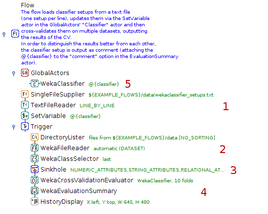
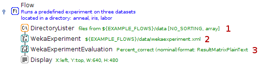

.. title: Examples
.. slug: users-examples
.. date: 2015-12-18 14:47:22 UTC+13:00
.. tags: 
.. category: 
.. link: 
.. description: 
.. type: text
.. author: FracPete

.. contents::

Choose a category of annotated examples:

Basic
=====

Workflows don't have to be complex to get the job done. But even flows with
only 10 actors already help documenting your work, preserving all steps in
volved in generating the results. These flows are a good introduction into the
many actors that ADAMS already has on offer.

Hello world flow
----------------

Absolute simple flow that merely displays the **Hello World** string.

.. media:: https://www.youtube.com/watch?v=FRNQhPSHJ1I

Cross-validating a single classifier on one dataset
---------------------------------------------------

Cross-validates a classifier (J48) on a single UCI dataset.

.. media:: https://www.youtube.com/watch?v=56Y97zIWsow

Dynamic evaluation of multiple classifiers on multiple datasets
---------------------------------------------------------------

Reads in set ups of WEKA classifiers stored in a text file and evaluates each
against all datasets in a directory.

1. Read in text file with classifier set ups, line by line, and store set up in
   in variable attached to the global actor (see 5)
2. Iterate over all datasets in directory and load them, one after the other
3. Drop datasets that don't meet required capabilities
4. Cross-validate classifier defined in 5 on datasets and output results
5. The classifier definition used in cross-validation, with variable attached
   to set up (gets updated when the variable changes its value)

Experiment on arbitrary datasets
--------------------------------

Adds datasets located in a directory to a pre-defined WEKA experiment, runs the
experiment and displays the evaluation.

1. Lists datasets in specified directory
2. Executes the pre-defined WEKA experiment (containing only classifier set
   ups, no datasets) using the datasets arriving at its input
3. Performs the evaluation of the experiment

Classifier ranking of parameter sweep
-------------------------------------

Generates a parameter sweep for multiple parameters of WEKA classifiers, ranks
these using 2-fold cross-validation and subjects the top 3 to a proper
evaluation.

.. image:: ../images/classifier_ranking.png

1. Generates the parameter sweep of 3 parameters: ridge of LinearRegression, #
   of components of PLS filter and type of PLS algorithm
2. Outputs all the generated setups
3. Ranks the performance of the classifiers using 2-fold cross-validation,
   outputs the top 3
4. Displays the set ups of the top 3 classifiers
5. The global training data

Visualization
=============

Time series
===========

Advanced
========

Others
======

**Note:** the videos should only be considered educational, as some of the
concepts in ADAMS have changed over time. E.g., *global* actors are now called
*callable*, since they can appear in different scopes within the flow. Also,
*SingleFileSupplier* and *MultiFileSupplier* got merged into the *FileSupplier*
actor.
